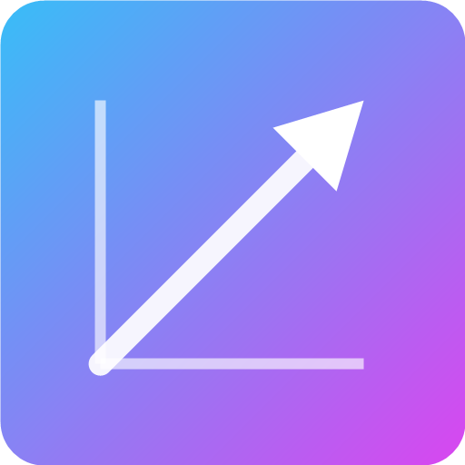
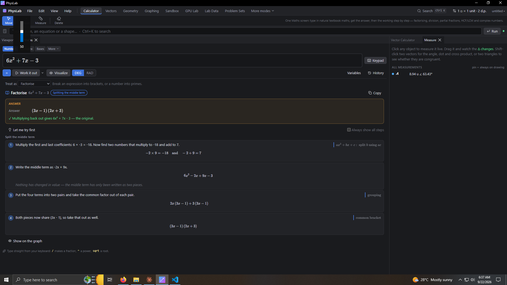
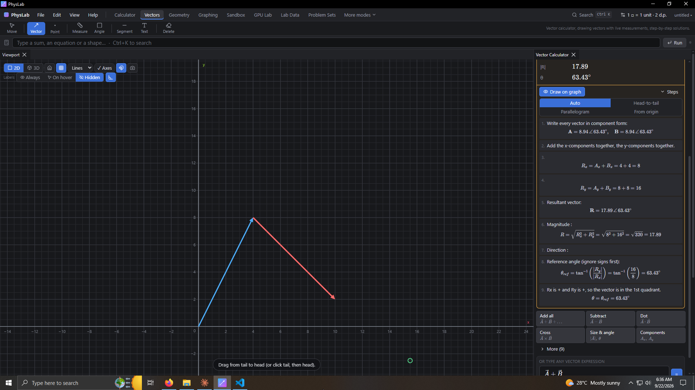
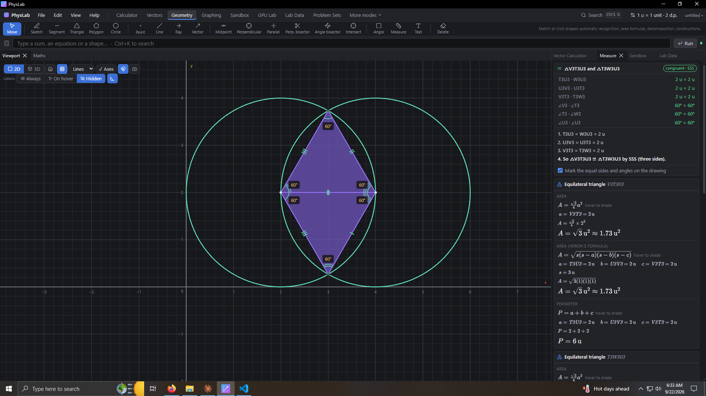
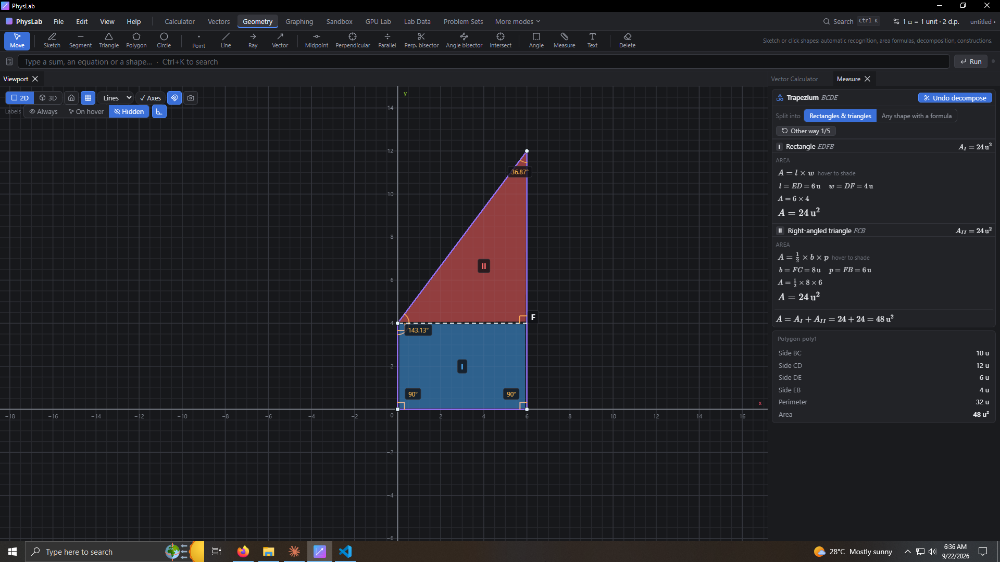
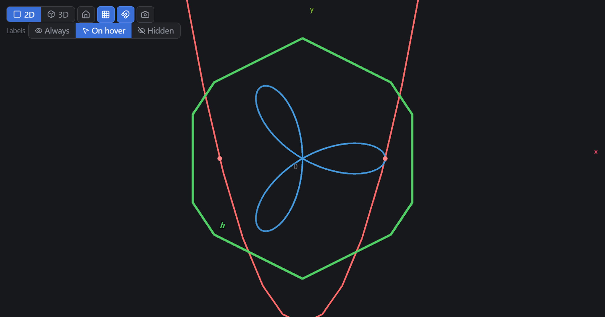
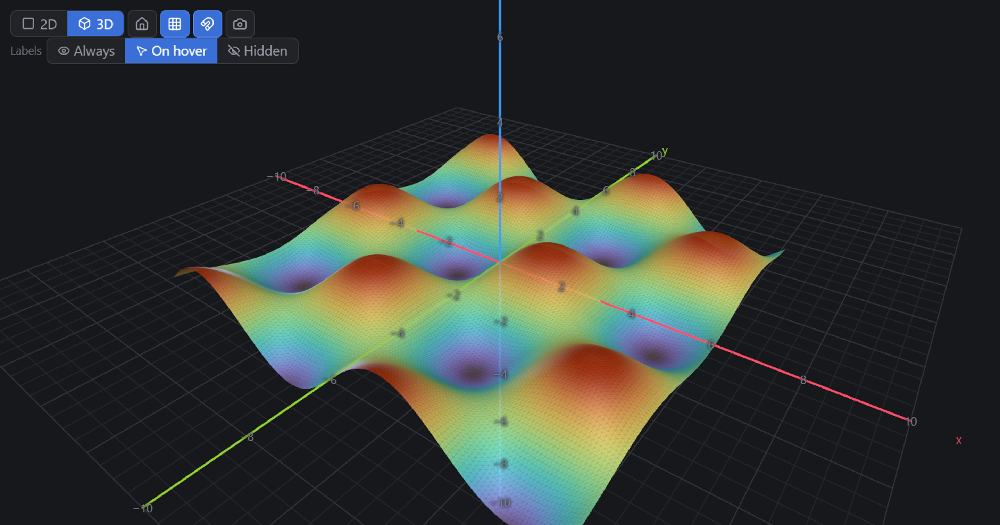
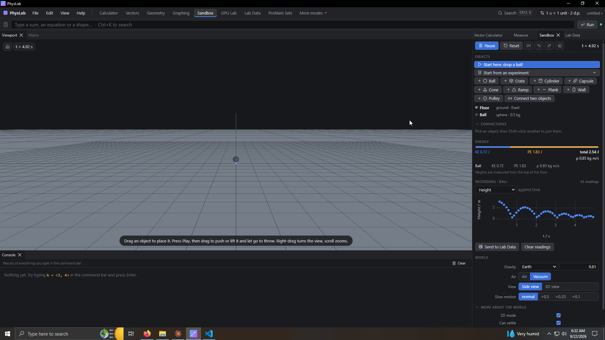
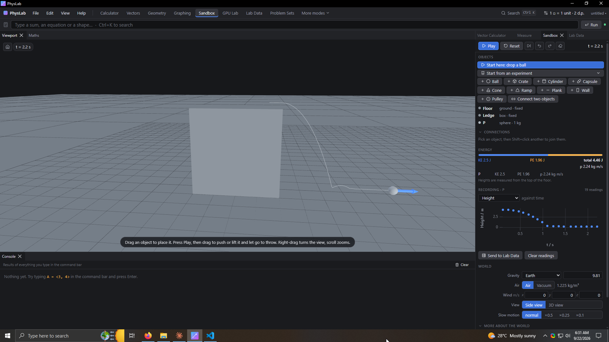
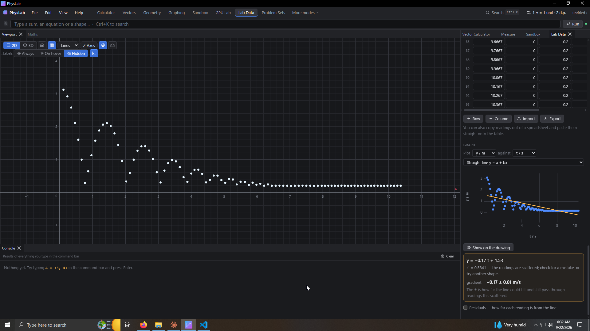

# PhysLab

A general math and physics engine for students and teachers: vectors, shapes and geometry,
graphing, a natural textbook-math calculator, step-by-step solutions and GPU simulations.
Everything runs offline.

<br clear="left" />

## Screenshots

<table>
<tr>
<td width="33%"></td>
<td width="33%"></td>
<td width="33%"></td>
</tr>
<tr>
<td align="center"><b>Calculator</b> — natural maths in, checked working out</td>
<td align="center"><b>Vectors</b> — add, resolve and see the steps</td>
<td align="center"><b>Geometry</b> — congruence proofs, every equality marked</td>
</tr>
<tr>
<td width="33%"></td>
<td width="33%"></td>
<td width="33%"></td>
</tr>
<tr>
<td align="center"><b>Geometry</b> — decomposition into simple parts</td>
<td align="center"><b>Graphing</b> — explicit, polar and more, in 2-D</td>
<td align="center"><b>Graphing</b> — 3-D surfaces</td>
</tr>
<tr>
<td width="33%"></td>
<td width="33%"></td>
<td width="33%"></td>
</tr>
<tr>
<td align="center"><b>Sandbox</b> — real objects, live energy and momentum</td>
<td align="center"><b>Sandbox</b> — every run can be recorded and plotted</td>
<td align="center"><b>Lab Data</b> — readings, best-fit line, gradient and its unit</td>
</tr>
</table>

## Run it

| What | Command |
| --- | --- |
| Install, or update an older version | `dist\PhysLab Setup 0.6.1.exe` |
| Run without installing | `dist\win-unpacked\PhysLab.exe` |
| Developer mode (live reload) | `npm run dev` |
| Rebuild the installer | `npm run dist` |
| Unit tests | `npm test` |

**Panels.** Closing a panel is not a dead end: **View** lists every panel with open/closed beside it, click one to bring it back. Ctrl+K finds them too, and entering a mode reopens the panel that mode uses. **View ▸ Reset the panel layout** puts everything back the way the mode starts.

**Updating.** Run the new setup: it swaps itself over the build you already have, keeps your
settings, your layout and your autosaved work, and starts the new version. Nothing to uninstall
first. Windows asks for permission once, because PhysLab lives in `C:\Program Files\PhysLab` for
every user of the PC. **Help ▸ PhysLab x.y.z** tells you which build is running.

## Modes

Features are grouped into modes, like a calculator. Pick one in the top bar, or press **Ctrl+K** to search everything.

| Mode | What it does |
| --- | --- |
| **Calculator** | Natural textbook math (fractions, roots, powers, ∫, Σ look like a book) with every fx-991EX mode: COMP, CMPLX, BASE-N, MATRIX, VECTOR, STAT, DIST, TABLE, EQN, INEQ, RATIO, SHEET, UNITS, CONST, MEASURE. A **popup keypad** opens under the field for the keys you need and stays open between entries — there is no permanent bank of buttons or a tiny fixed display, so the screen is not trying to look like a handheld calculator. **Visualize** draws the calculation (tangent line for d/dx, shaded area for ∫). Every number shown follows your precision setting (decimal places or significant figures). |
| **Vectors** | **Vector Calculator** panel: type vectors as `3î + 4ĵ` or `size ∠ angle`, one-click operations (sum, difference, dot, cross, projection, equilibrium, torque, work, magnetic force, relative velocity…) and step-by-step working. |
| **Shapes & Geometry** | **Sketch** a rough shape and it snaps to a perfect square, rectangle, triangle, circle… Click corners or draw connected segments and closed loops are recognised too. The Measure tab shows the shape's name and its **area in algebraic form**. |
| **Graphing** | `y = x^2 - 4`, `x^2 + y^2 = 9`, `y > x^2`, `r = 2cos(3θ)`, `z = sin(x)cos(y)`, sliders, roots and turning points. |
| **Sandbox** | Real objects that collide, on the Jolt physics engine. Start from an experiment — projectile, collision, recoil, pendulum, mass on a spring — or build your own from balls, crates, cylinders, capsules, cones, ramps, planks and walls. |
| **GPU Lab** | Millions of charged particles in E and B fields on the graphics card. |
| **Lab Data** | The table from your practical notebook: type or paste your readings, work a column out from the others (`t^2`), plot one against another and fit a line through them. Gives you the equation, r², and the gradient with its unit, its meaning and its ±. |
| **Problem Sets** | Practice with fresh numbers every time. **Hint** gives you one step, not the answer. **Check my answer** marks what *you* worked out on paper and names the mistake. |
| Coming next | Proofs, Mechanics, Instruments, Electricity & Electronics, Optics, Waves & Sound, Heat, Nuclear & Modern. |

## Drawing, finishing and the right-click menu

- While you draw: **right-click, Enter or double-click** finishes the shape, **Backspace** removes the last point, **Esc** cancels. The same three buttons appear next to the hint at the bottom of the drawing.
- **Right-click** any object for what you can do with it: show components, resolve with steps, midpoint, perpendicular bisector, decompose, show angles, pin its label, rename, delete. Right-clicking empty space gives view, grid, snapping and label options. The same menu works in the Outliner and the Measure list.
- A point clicked **on a side or a circle** sticks to it and slides along it when dragged.

## Practice and hints

- **Problem Sets** mode: choose your topics (components, resultant, dot and cross product, equilibrium, work, torque, projection…), choose 3, 5 or 10 questions, and PhysLab makes new numbers every time.
- Work the question out on paper, type what you got, and press **Check my answer**. A right answer is a right answer even if you rounded: anything within 1% is correct, and a slightly rounded one is marked right with a note.
- A wrong answer is told *why* it is wrong whenever PhysLab can recognise the mistake — "That is F sin θ. The x-component uses cos", "Right reference angle, wrong quadrant", "That is the resultant R; the balancing force is equal and opposite", "That is the answer in radians".
- **Hint** shows the first step of the worked solution. Press it again for the next step. The answer only appears when you ask for it.
- The same **Give me a hint** button is in the Solver panel, so any solved problem can be revealed one step at a time.
- **Show in scene** draws the problem with its vectors and components, so you can see what the numbers mean.

## Lab data: readings from your own experiment

**Lab Data** mode is the table you fill in during a practical, with the graph and the write-up
attached to it.

- **Type or paste the readings.** Copy a block out of a spreadsheet and paste it straight onto the
  table — tabs, commas or semicolons, and a decimal comma if that is how your machine writes
  numbers. **Import** reads a `.csv`, **Export** writes one. Anything pasted or imported can be
  **undone** with one click.
- **A column can be worked out from the others.** Press **Σ** on a column and write `t^2` or `d/t`.
  It fills itself in for every row and updates when you change a reading.
- **Headers carry the unit** (`t / s`), so the graph axes and the gradient's unit come from the
  table itself: metres over seconds is quoted as m/s without being told.
- **The fit is your choice, and PhysLab says when another shape matches better** — "curve fits your
  readings better — r² 0.998 against 0.874" — with one button to switch, so you can justify the
  shape you chose.
- **The gradient comes with what it means**: distance against time is a speed, velocity against
  time is an acceleration, d against t² gives g = 2 × gradient, T² against length gives
  g = 4π²/gradient, force against extension is the spring constant.
- **Uncertainties, only when you ask.** Press **±** on a column and it gains a ± column beside it.
  The readings then carry error bars, and the gradient is quoted the way a practical is marked:
  from the steepest and shallowest lines that still pass through the bars, with the value rounded
  to the place the uncertainty supports — `4.92 ± 0.04 m/s²`, never more digits than you measured.
  Without bars the ± comes from how much the readings scatter about the line.
- **Residuals** (reading minus line), off by default, show the pattern a good r² can hide.
- **Show on the drawing** puts the points and the fitted line into the main viewport, where they
  can be measured, zoomed and exported as a picture like anything else.
- Tables are saved inside the `.phys` project, so an experiment reopens with the drawing.

Examples ▸ **Free fall: find g from d and t** sets the whole thing up in one click.

## Help for new users

- On the first run a welcome card offers a **two-minute tour** and four starting points.
- **Help ▸ Practice tasks** lists small tasks ("Draw a vector", "Sketch a shape", "Split a shape into simple parts") that tick themselves off as you do them.
- **Help ▸ Keyboard and mouse** lists every shortcut. Everything is also in **Ctrl+K**.

## Measurements

- Labels show an object's letter and value (`A 5 u ∠ 53.13°`, side lengths, areas, angles).
- **When labels show** (switch at the top-left of the viewport, or the settings menu):
  - **On hover** (default): a label appears when you point at or select an object and fades out when the cursor moves away. Pointing at a shape shows all its sides and its area.
  - **Always**: every label stays on.
  - **Hidden**: nothing on the drawing; the **Measure** panel lists every value at the side.
- **Pin** a label to keep it on whatever the setting: the pin button in the Measure list or Outliner, or *On drawing* in Properties (which can also hide one label for good).
- Point letters (A, B, C…) stay visible by default so formulas like `AB = 4` are readable; untick this in the settings menu.
- **Settings button** in the top bar: 1 grid square = 1 unit / mm / cm / m / km / in / ft, decimal places or significant figures, and what labels contain. Label choices are remembered.
- **Notation** (same menu), so PhysLab matches whatever book is in front of you: vectors as A⃗, **A** or A̲; components as 3î + 4ĵ, (3, 4), a column or size ∠ angle; directions from the +x axis or as compass bearings (N 30° E).
- Snapping is magnetic: it only jumps to a point, grid crossing or axis when you are close. Hold **Alt** to switch snapping off, **Shift** to draw at 15° steps.

## Command bar examples

- `A = <3, 4>`, `F = 10 N ∠ 30°`, `R = A + B`, `A · B`, `A × B`, `|A|`
- `components(10, 30)`, `resultant(5, 5, 120)`, `equilibrium(A, B)`
- `Triangle((0,0), (4,0), (0,3))`, `Polygon((0,0), (6,0), (6,4), (3,7), (0,4))`, `Circle(P, 3)`
- `solve(x^2 - 5x + 6 = 0)`, `diff(x^3)`, `integrate(x^2, 0, 3)`
- `factorise(6x^2 + 7x - 3)`, `hcf(84, 132, 210)`, `lcm(12, 18)`, `primes(360)`, `divide((x^3-1)/(x-1))`, `partial((3x+5)/((x+1)(x+2)))`, `complex((2+3i)/(1-i))` — each writes out its working in the Working panel
- `k = 2` makes a slider; use `t` in formulas and press Play to animate. Type `help` for more.

Shortcuts: `Ctrl+K` search · `Tab` 2D/3D · `Home` reset view · `Space` play/pause · `Ctrl+Z / Ctrl+Y` undo/redo · `Del` delete · `Esc` back to Move · `Ctrl+S` save a `.phys` project.

## Teachers and classrooms

- **Light theme** for bright rooms and projectors (View ▸ Light theme); dark stays the default.
- **Export the drawing** as a PNG at 1× or 2×, labels and axis numbers included (camera button on the drawing, or File ▸ Export).
- **Auto-save**: unsaved work is copied aside every minute, and offered back if the app closes unexpectedly.
- The panel arrangement and the mode you were in are remembered (View ▸ Reset the panel layout puts them back).
- Lessons are grouped by topic with **Basic / Intermediate / Advanced** tags and a search box — no chapter numbers, so any syllabus fits.

## Performance on any PC

- The viewport only redraws when something changes (near-zero CPU when idle).
- WebGPU when available, otherwise WebGL2; quality (Auto/Low/Medium/High, top right of the viewport) adjusts resolution, graph detail and particle counts.
- Test switches: `PHYSLAB_FORCE_WEBGL=1` (no WebGPU), `PHYSLAB_SWIFTSHADER=1` (software graphics), `PHYSLAB_BENCH=1000000` (particle benchmark), `PHYSLAB_SANDBOX=1` (open the sandbox and report what the physics is doing), `PHYSLAB_LOG=1` (log to terminal).

## Is the physics real?

The sandbox uses [Jolt](https://github.com/jrouwe/JoltPhysics) (MIT), the engine behind several big games, and `npm test` checks it against the formulas rather than trusting it: free fall covering ½gt², equal masses swapping velocities in an elastic hit, momentum kept and energy lost in an inelastic one, a bounce to e² of the height, a block that holds on a 10° slope and slides on a 35° one with μ = 0.3, and terminal velocity matching √(2mg/ρC_dA) within 3%.

## Layout of the code

```
src/main          Electron window, app:// protocol, file dialogs, test switches
src/preload       safe bridge for open/save
src/renderer/src
  app/            top bar, modes, search, tool shelf, command bar, dock layout, shortcuts
  core/           scene store, dependency evaluation, object factory, visualize bridge
  math/           vectors, geometry, shapes & decomposition, area formulas, LaTeX conversion,
                  expression language, step solvers, graphs, CAS client
  calc/           calculator engine, constants, calculator state
  sim/            physics sandbox: Jolt bridge, bodies, materials, air drag, world settings
  lang/           command-bar interpreter
  render/         viewport, grid, objects, labels, highlights, graphs, picking, tools, GPU particles
  panels/         Outliner, Examples, Vector Calculator, Measure (+ shape info), Properties, Solver,
                  Calculator, Console, Timeline, Graphs, GPU Lab
  ui/             MathInput (MathLive), KaTeX, fields, error boundary
  workers/        SymPy (Pyodide) algebra worker, loaded on first use
```

New modes plug in through `app/modes.ts`: a tool shelf and panel, object types in `core/types.ts`,
renderers in `render/`, and commands in `lang/commands.ts`.

## Licence and contributing

PhysLab is free software under the **GNU General Public License v3.0** — see [LICENSE](LICENSE).

You may use it, study it, share it and change it. If you distribute a changed version you must
publish your source under the same licence, so that it stays free for the next student who needs
it. That is the whole point of the choice.

[CONTRIBUTING.md](CONTRIBUTING.md) explains what is most useful to send, and the five rules that do
not bend. The most valuable contribution is not code: it is telling us what broke while you were
using it.

Copyright © 2026 the PhysLab contributors.
